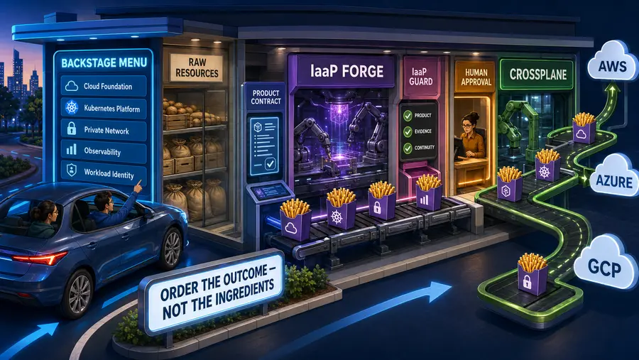
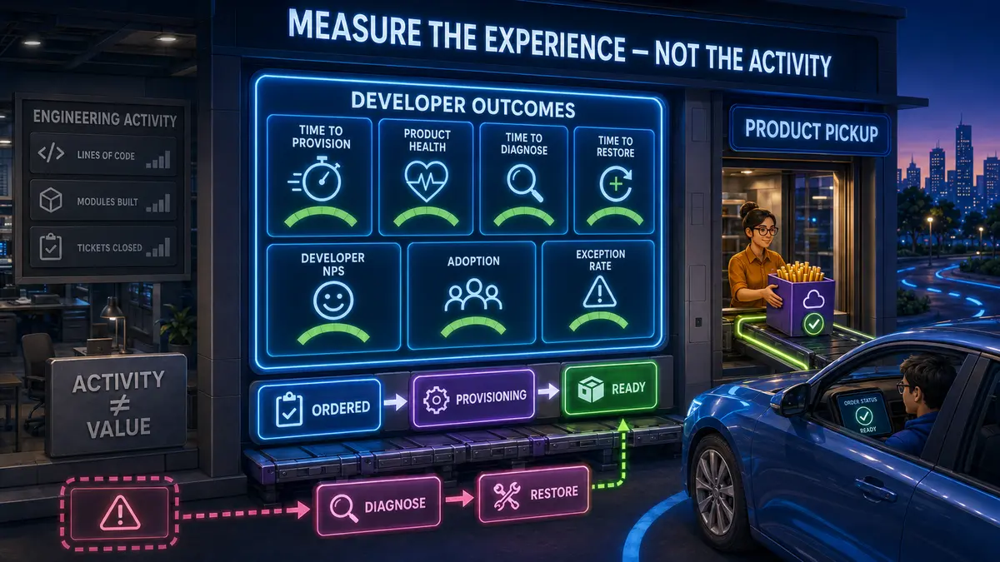

# IaaP Guard

> **IaaS is what you buy. Infrastructure-as-a-Product is what you build. IaaP Guard helps teams keep building it that way.**

IaaP Guard is a hosted GitHub App for deterministic Infrastructure-as-a-Product architecture review, evidence continuity, and trusted multi-repository product assessment.

## Use IaaP Guard

Install the hosted App from [github.com/apps/iaap-guard](https://github.com/apps/iaap-guard).

For supported pull-request events, the App publishes the `IaaP Guard / Architecture` Check with:

- an architecture conclusion and coverage score;
- normalized findings and bounded recommendations;
- advisory PR-base Evidence Continuity;
- trusted multi-repository product context when reciprocal product scope is configured; and
- immutable repository and revision evidence.

The App requires only repository metadata read, contents read, pull-request read, and checks read/write permissions. It does not request repository content-write, merge, workflow-administration, customer-cloud, provisioning, remediation, exception, or risk-acceptance authority.

Read [adoption prerequisites](docs/ADOPTION-PREREQUISITES.md), [known limits](docs/KNOWN-LIMITS.md), and [support guidance](docs/SUPPORT.md) before the first live evaluation.

## Composite Action retired

The former public composite Action is retired. New and current integrations should use the hosted GitHub App.

Historical commits and immutable tags remain available for users already pinned to them, but they are not the supported delivery path and do not receive current product or security updates. Workflows using `SAABOLImpactVenture/iaap-guard@main` now fail with a direct migration message rather than silently running an unsupported implementation.

## Public repository scope

This repository is the public product, adoption, interface, and assurance surface. It contains:

- installation and adoption documentation;
- public schemas and interface contracts;
- architecture and authority boundaries;
- synthetic and historical validation evidence;
- security and support policies; and
- the explicit Action-retirement shim.

The hosted evaluation engine, rule implementation, GitHub App runtime, AWS deployment assets, internal fixtures, and regression tests are maintained privately.

No Git history was rewritten during this transition. Previously published commits remain part of repository history.

## Product model

Application developers should consume standard infrastructure outcomes through a storefront such as Backstage instead of assembling raw cloud ingredients.

  

Useful product evidence centers developer outcomes: time to provision, product health, diagnosis and restoration time, adoption, exception rate, and Developer NPS.

  

## Proven evidence

- [Live multi-repository federation acceptance](https://github.com/SAABOLImpactVenture/ai-powered-infrastructure-as-a-product/blob/main/artifacts/phase-12/live-federation-acceptance.json)
- [Live PR-base Evidence Continuity acceptance](https://github.com/SAABOLImpactVenture/ai-powered-infrastructure-as-a-product/blob/main/artifacts/phase-14/live-acceptance.json)
- [Private-runtime cutover acceptance PR](https://github.com/SAABOLImpactVenture/ai-powered-infrastructure-as-a-product/pull/133), closed unmerged after PASS 100 / SUPPORTED Check Run `95901157382`

## Authority boundary

IaaP Guard provides deterministic evidence. It does not decide whether an action is legally, institutionally, operationally, security, compliance, exception, risk-acceptance, or deployment-authorized. Evidence continuity is not authorization continuity.

See [Product](docs/PRODUCT.md), [Architecture](docs/ARCHITECTURE.md), [Evidence Continuity](docs/EVIDENCE-CONTINUITY.md), and [Multi-repository products](docs/MULTI-REPOSITORY-PRODUCTS.md).

## Security

Report suspected vulnerabilities through GitHub Private Vulnerability Reporting. Do not place credentials, exploit details, private repository information, or sensitive reproduction material in a public issue. See [SECURITY.md](SECURITY.md).

## License

The public contents of this repository remain under the existing [Apache License 2.0](LICENSE). This transition does not rewrite history or change the license previously attached to published material.
