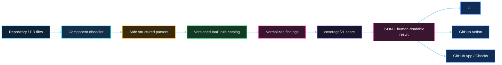
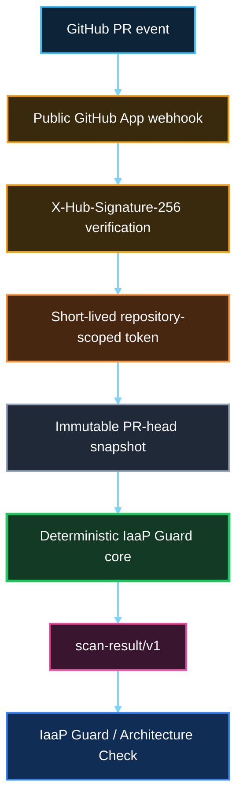

<p align="center">
  
</p>

# IaaP Guard

> **IaaS is what you buy. Infrastructure-as-a-Product is what you build. IaaP Guard makes sure you keep building it that way.**

IaaP Guard is a GitHub-native architecture and product-governance system that evaluates whether infrastructure is actually being engineered as a product.

## Product architecture

The product is intentionally small: a deterministic, stateless repository/PR evaluator with a reusable local core. It does **not** provision infrastructure, connect to customer clouds or Kubernetes clusters, run Terraform/TFE, remediate changes, or compete with generic security scanners.

```text
Repository / PR files
        ↓
Component classifier
        ↓
Structured deterministic parsers
        ↓
Versioned IaaP rule catalog
        ↓
Normalized findings
        ↓
Coverage-based maturity score
        ↓
JSON + human-readable result
```

### Architecture at a glance



Adapters remain thin around the same core:

```text
IaaP Guard Core
   ├── CLI
   ├── GitHub Action     # Phase 9 dogfood
   └── GitHub App        # Phase 10 public installation + Checks
```

The adapter is not the product. The durable product IP is the system of IaaP product knowledge, rules, evidence, compatibility, and operating model.

<p align="center">
  
</p>

## Deterministic core

The merged Phase 8 core implements:

- context classification before rule evaluation;
- safe YAML/JSON and bounded text loading without executing repository code;
- all 11 rules in `rules/catalog.yaml`;
- normalized `scan-result/v1` output;
- transparent `coverage/v1` scoring;
- human-readable and JSON CLI output;
- the frozen positive/negative fixture contract; and
- repeatability, schema, scoring, fixture-isolation, and non-execution tests.

Run the complete validation gate:

```bash
python3 -m pip install -r requirements-ci.txt
make validate
```

Run a local scan:

```bash
PYTHONPATH=src python3 -m iaap_guard.cli scan . \
  --repository example/platform-repo \
  --revision 0123456789abcdef0123456789abcdef01234567
```

Use `--format json` for the normalized machine-readable contract.

## From architecture evidence to an improvement plan

IaaP Guard does more than identify Infrastructure-as-a-Product architecture gaps. When deterministic findings exist, Guard can translate that evidence into a versioned, traceable **Improvement Plan**:

```text
Architecture Evidence → Objectives → Key Results → Epics → Features → Candidate User Stories → Candidate Tasks → Acceptance Evidence
```

Epics are explicitly mapped to measurable Key Results, and every proposed work item retains traceability back to the Guard rule and repository evidence that caused it. The planning layer therefore helps a team move from **“what is wrong?”** to **“what should we plan to improve?”** without disconnecting delivery work from the architecture evidence that justified it.

The planning layer is intentionally advisory. IaaP Guard does **not** assign work, manage sprints, estimate capacity, autonomously create backlog items, or execute remediation. Candidate stories and tasks are a planning starting point for accountable teams, not execution commitments.

Generate a Markdown plan locally:

```bash
PYTHONPATH=src python3 -m iaap_guard.cli plan . \
  --repository example/platform-repo \
  --revision 0123456789abcdef0123456789abcdef01234567
```

Use `--format json` for the normalized `planning-report/v1` contract. See [`docs/PLANNING-REPORT.md`](docs/PLANNING-REPORT.md) for the planning semantics and product boundary.

## One product, multiple repositories

Infrastructure products do not have to fit inside one repository. A product contract, storefront, control plane, governance policy, evidence, and integration tests can remain independently owned while still forming **one logical infrastructure product**.

IaaP Guard can register that boundary with a trusted `.iaap/product.yaml` and produce both repository-level and product-level results:

```text
platform-contracts ─┐
backstage-storefront ├──→ IaaP Product Assessment
crossplane-control  ┤        ↓
platform-policies   ┤   Product Improvement Plan
platform-evidence  ─┘        ↓
                     OKRs → Epics → Features → Stories → Candidate Tasks
```

Product scope adds:

- `iaap-product/v1` membership and role metadata;
- `product-assessment/v1` across registered member repositories;
- aggregate dimension coverage plus the weakest-member score;
- **INCOMPLETE** when required repository evidence is unavailable;
- fail-safe semantics so a member FAIL cannot be averaged away;
- cross-repository contract and reconciler relationship checks;
- repository-qualified finding traceability; and
- `product-planning-report/v1` for one evidence-backed improvement plan across the product boundary.

The GitHub App does not trust a PR to expand its own read scope. Product membership is read from the triggering repository's **default branch**, and related repositories are evaluated only when they are explicitly registered, under the same owner and visibility, and accessible through IaaP Guard. Each related repository uses a separate short-lived token restricted to that one repository with `contents:read`.

In V1 the triggering repository still owns the GitHub Check conclusion; the product result is advisory context. This prevents an unrelated existing issue in another member repository from unexpectedly blocking the current PR.

See [`docs/MULTI-REPOSITORY-PRODUCTS.md`](docs/MULTI-REPOSITORY-PRODUCTS.md) for the manifest, trust model, snapshot semantics, cross-repository rules, CLI commands, and product-level planning contract.

## Phase 9 GitHub Action

Phase 9 proved a thin composite Action around the same deterministic engine across the six-repository IaaP portfolio.

Pin it to an immutable commit:

```yaml
permissions:
  contents: read

steps:
  - uses: actions/checkout@v7
  - uses: actions/setup-python@v7
    with:
      python-version: '3.12'
  - id: iaap-guard
    uses: SAABOLImpactVenture/iaap-guard@<40-character-commit-sha>
    with:
      fail-on-failure: 'false'
```

See `docs/GITHUB-ACTION.md` and `artifacts/phase-9/` for the authority, repeatability, mutation, false-positive, and portfolio evidence.

## Phase 10 public GitHub App beta

Phase 10 adds the smallest public-installation adapter around the proven core.

```text
GitHub PR event
    ↓
Public GitHub App webhook
    ↓
X-Hub-Signature-256 verification
    ↓
Short-lived repository-scoped installation token
    ↓
Immutable PR-head repository snapshot
    ↓
Existing deterministic IaaP Guard core
    ↓
scan-result/v1
    ↓
IaaP Guard / Architecture Check Run
```

### Public App event path



The initial hosting implementation uses **AWS Lambda + Function URL** because the core is already Python and the beta does not require a persistent database. Hosting remains replaceable; it is not part of the rule engine or consumer contract.

The V0 App authority is frozen in `config/github-app-v0.json`:

- Metadata: read;
- Contents: read;
- Pull requests: read;
- Checks: write;
- no PAT;
- no repository content writes;
- no workflow/administration permissions;
- no cloud, Kubernetes, Terraform/TFE, or AI credentials.

For each handled event, the installation token is narrowed to the **triggering repository** and discarded after the stateless invocation. The adapter publishes `IaaP Guard / Architecture` using the deterministic core conclusion: `success`, `neutral`, or `failure`.

When the deterministic scan produces WARNING or FAIL findings, the current beta adapter also appends a compact **Improvement Plan** to the Check. PASS/no-finding and no-relevant-change results do not invent backlog work.

See `docs/GITHUB-APP-BETA.md` for the registration, security, deployment, Check Run, and beta-limit contract.

## V0 principles

- Product over tooling.
- Stable consumer contracts.
- Replaceable experience layer.
- Bounded intelligence.
- Deterministic governance.
- Human authorization.
- Evidence first.
- One authoritative reconciler.
- Least privilege.
- Context-aware analysis rather than naive keyword grep.
- Minimum effort first.

## Repository contents

- `docs/PRODUCT.md` — product definition and explicit V0 exclusions.
- `docs/ARCHITECTURE.md` — deterministic center and adapter boundaries.
- `docs/RULE-CATALOG.md` — V0 deterministic rule semantics.
- `docs/SCORING.md` — transparent coverage-based maturity model.
- `docs/CORE.md` — implemented deterministic engine contract and limitations.
- `docs/PLANNING-REPORT.md` — OKR-to-backlog planning semantics and product boundary.
- `docs/MULTI-REPOSITORY-PRODUCTS.md` — product membership, cross-repository trust, assessment, and planning semantics.
- `docs/DOGFOOD.md` — Phase 9 six-repository evidence plan.
- `docs/GITHUB-ACTION.md` — Phase 9 Action adapter and authority boundary.
- `docs/GITHUB-APP-BETA.md` — Phase 10 public GitHub App beta contract and deployment guide.
- `config/github-app-v0.json` — machine-readable App permissions/events contract.
- `deploy/aws-lambda/template.yaml` — minimal stateless beta runtime deployment.
- `adr/` — architecture decisions for deterministic-first, context-aware analysis and bounded distribution.
- `rules/catalog.yaml` — machine-readable V0 rule catalog.
- `planning/catalog.yaml` — versioned deterministic planning templates.
- `schemas/scan-result.schema.json` — normalized repository result contract.
- `schemas/planning-report.schema.json` — normalized repository improvement-plan contract.
- `schemas/product-manifest.schema.json` — multi-repository product membership contract.
- `schemas/product-assessment.schema.json` — normalized product assessment contract.
- `schemas/product-planning-report.schema.json` — normalized product improvement-plan contract.
- `fixtures/` — positive and negative architecture cases.
- `src/iaap_guard/` — deterministic core plus thin GitHub App and product-scope adapters.
- `tests/` — frozen fixture, engine-invariant, adapter/security, planning, and product-scope tests.
- `action.yml` — thin GitHub Action dogfood adapter.

## Current status

**PHASE 8 — Deterministic Core: COMPLETE**  
**PHASE 9 — Dogfood POC: COMPLETE**  
**PHASE 10 — Public Installable Beta: IN PROGRESS**  
**PHASE 11 — Evidence-to-Planning Layer: COMPLETE**  
**PHASE 12 — Multi-Repository Product Scope: IN PROGRESS**

Phase 9 proved the deterministic engine against the actual six-repository portfolio with 6/6 accepted baselines at 100/100, zero final findings, complete critical-mutation coverage, and repeatable normalized results. Phase 10 is proving public/private GitHub App installation and GitHub Check delivery without introducing a SaaS database, PATs, or customer infrastructure credentials. Phase 11 added the advisory `planning-report/v1` path. Phase 12 adds explicit multi-repository product membership, fail-safe product aggregation, bounded cross-repository relationship checks, trusted GitHub federation, and product-level OKR planning without turning related-repository access into broad installation authority.
