<p align="center">
  
</p>

# IaaP Guard

> **IaaS is what you buy. Infrastructure-as-a-Product is what you build. IaaP Guard makes sure you keep building it that way.**

IaaP Guard is a GitHub-native architecture, product-governance, and evidence-continuity system that evaluates whether infrastructure is actually being engineered as a product — and whether the evidence supporting a previously observed governance state still applies after change.

Its two core product questions are:

> **Is this infrastructure actually being designed, delivered, and governed as a product?**
>
> **When the product changes, can we reconstruct what Guard observed, what changed, and whether accountable revalidation is required?**

IaaP Guard does **not** decide whether an action is legally, institutionally, operationally, or deployment-authorized. Evidence continuity is not authorization continuity.

## Product architecture

The product remains intentionally small: a deterministic, stateless repository/PR evaluator with a reusable local core. It does **not** provision infrastructure, connect to customer clouds or Kubernetes clusters, run Terraform/TFE, remediate changes, or compete with generic security scanners.

```text
Repository / PR files
        ↓
Component classifier
        ↓
Structured deterministic parsers
        ↓
Versioned IaaP rule catalog
        ↓
Normalized findings + coverage score
        ↓
scan-result/v1
        ↓
Evidence manifest + prior/current comparison
        ↓
continuity/v1
        ↓
SUPPORTED / REVIEW REQUIRED / NOT ESTABLISHED
        ↓
CLI + GitHub Action + GitHub App / Checks
```

### Architecture at a glance

```mermaid
flowchart LR
  REPO[Repository / PR files] --> CLASS[Component classifier]
  CLASS --> PARSE[Safe structured parsers]
  PARSE --> RULES[Versioned IaaP rule catalog]
  RULES --> FIND[Normalized findings]
  FIND --> SCORE[coverage/v1 score]
  SCORE --> SCAN[scan-result/v1]
  SCAN --> EVID[evidence-manifest/v1]
  BASE[Prior / PR-base evidence] --> EVID
  EVID --> CONT[continuity/v1]
  CONT --> CLI[CLI]
  CONT --> ACTION[GitHub Action]
  CONT --> APP[GitHub App / Checks]

  classDef input fill:#0D2438,stroke:#38BDF8,stroke-width:2px,color:#F8FAFC
  classDef classifier fill:#12304A,stroke:#22D3EE,stroke-width:2px,color:#F8FAFC
  classDef governance fill:#3A2A0D,stroke:#F59E0B,stroke-width:2px,color:#F8FAFC
  classDef rules fill:#123A24,stroke:#22C55E,stroke-width:3px,color:#F8FAFC
  classDef evidence fill:#3A1530,stroke:#EC4899,stroke-width:2px,color:#F8FAFC
  classDef adapter fill:#102D55,stroke:#3B82F6,stroke-width:2px,color:#F8FAFC
  class REPO,BASE input
  class CLASS classifier
  class PARSE governance
  class RULES rules
  class FIND,SCORE,SCAN,EVID,CONT evidence
  class CLI,ACTION,APP adapter
  linkStyle default stroke:#7DD3FC,stroke-width:2px
```



Adapters remain thin around the same core:

```text
IaaP Guard Core
   ├── CLI
   ├── GitHub Action
   └── GitHub App
```

The adapter is not the product. The durable product IP is the system of IaaP product knowledge, deterministic rules, evidence, continuity semantics, compatibility, and operating model.

<p align="center">
  
</p>

## Deterministic architecture evaluation

The deterministic core implements:

- context classification before rule evaluation;
- safe YAML/JSON and bounded text loading without executing repository code;
- all rules in `rules/catalog.yaml`;
- normalized `scan-result/v1` output;
- transparent `coverage/v1` scoring;
- human-readable and JSON CLI output;
- frozen positive/negative fixture contracts; and
- repeatability, schema, scoring, fixture-isolation, and non-execution tests.

Run the complete validation gate:

```bash
python3 -m pip install -r requirements-ci.txt
make validate
```

Run a local scan:

```bash
PYTHONPATH=src python3 -m iaap_guard.cli scan . \
  --repository example/platform-repo \
  --revision 0123456789abcdef0123456789abcdef01234567
```

Use `--format json` for the normalized machine-readable contract.

## Evidence Continuity

Architecture PASS/FAIL is only a point-in-time statement about the evidence Guard evaluated. Phase 13 adds a deterministic evidence contract that can compare a prior Guard state with the current state and answer a narrower, more durable question: **does the evidence supporting the previous Guard-observed state still apply?**

The core produces `evidence-manifest/v1` and bounded continuity states:

- **SUPPORTED** — Guard found no material rule/finding change within its deterministic scope;
- **REVIEW REQUIRED** — Guard detected a material change that should be revalidated by an accountable human or governed process;
- **NOT ESTABLISHED** — a trustworthy baseline was not available.

The evidence record can preserve exact revisions, ruleset/scoring versions, rule-state transitions, introduced/resolved finding evidence, and deterministic evidence digests. It is designed to make a governance sequence reconstructable without converting Guard into a compliance or authorization oracle.

Generate evidence locally:

```bash
PYTHONPATH=src python3 -m iaap_guard.cli evidence . \
  --repository example/platform-repo \
  --revision <CURRENT_SHA> \
  --baseline prior-scan-result.json \
  --scan-output current-scan-result.json \
  --format json
```

See [`docs/EVIDENCE-CONTINUITY.md`](docs/EVIDENCE-CONTINUITY.md) for the deterministic evidence model and authority boundary.

## PR-base Evidence Continuity

Phase 14 moves Evidence Continuity into the normal GitHub pull-request experience. For an IaaP-relevant PR, the GitHub App uses the immutable **PR-base SHA** as the technical baseline and the immutable **PR-head SHA** as the current state.

```text
GitHub PR
   ├── base SHA ──→ deterministic scan ──┐
   └── head SHA ──→ deterministic scan ──┤
                                         ↓
                              evidence-manifest/v1
                                         ↓
                                   continuity/v1
                                         ↓
                     IaaP Guard / Architecture Check
```

The PR cannot nominate its own baseline. GitHub PR state supplies the base revision. Evidence Continuity remains **advisory**: repository scan semantics still own the Check conclusion, while `REVIEW REQUIRED` signals that prior evidence should not silently be treated as current authorization or current governance applicability.

See [`docs/PR-BASE-EVIDENCE-CONTINUITY.md`](docs/PR-BASE-EVIDENCE-CONTINUITY.md) for the GitHub adapter behavior.

## From architecture evidence to an improvement plan

IaaP Guard can translate deterministic findings into a versioned, traceable **Improvement Plan**:

```text
Architecture Evidence → Objectives → Key Results → Epics → Features → Candidate User Stories → Candidate Tasks → Acceptance Evidence
```

Epics map to measurable Key Results, and proposed work retains traceability back to the Guard rule and repository evidence that caused it. The planning layer helps a team move from **“what is wrong?”** to **“what should we plan to improve?”** without disconnecting delivery work from the architecture evidence that justified it.

The planning layer is intentionally advisory. IaaP Guard does **not** assign work, manage sprints, estimate capacity, autonomously create backlog items, or execute remediation.

Generate a Markdown plan locally:

```bash
PYTHONPATH=src python3 -m iaap_guard.cli plan . \
  --repository example/platform-repo \
  --revision 0123456789abcdef0123456789abcdef01234567
```

See [`docs/PLANNING-REPORT.md`](docs/PLANNING-REPORT.md) for the planning semantics and product boundary.

## One product, multiple repositories

Infrastructure products do not have to fit inside one repository. A product contract, storefront, control plane, governance policy, evidence, and integration tests can remain independently owned while still forming **one logical infrastructure product**.

IaaP Guard can register that boundary with a trusted `.iaap/product.yaml` and produce both repository-level and product-level results:

```text
platform-contracts ─┐
backstage-storefront ├──→ IaaP Product Assessment
crossplane-control  ┤        ↓
platform-policies   ┤   Product Improvement Plan
platform-evidence  ─┘        ↓
                     OKRs → Epics → Features → Stories → Candidate Tasks
```

Product scope adds:

- `iaap-product/v1` membership and role metadata;
- `product-assessment/v1` across registered member repositories;
- aggregate dimension coverage plus the weakest-member score;
- **INCOMPLETE** when required repository evidence is unavailable;
- fail-safe semantics so a member FAIL cannot be averaged away;
- cross-repository consumer/canonical contract compatibility checks;
- repository-qualified finding traceability; and
- `product-planning-report/v1` for one evidence-backed improvement plan across the product boundary.

The GitHub App does not trust a PR—or one repository acting alone—to expand related-repository read scope. Product membership is read from trusted **default branches**, and a related repository participates only when it reciprocally declares the same product identity and membership, is under the same owner and visibility, and is accessible through IaaP Guard.

In V1 the triggering repository still owns the GitHub Check conclusion; product scope and Evidence Continuity are advisory context rather than hidden new blocking authorities.

See [`docs/MULTI-REPOSITORY-PRODUCTS.md`](docs/MULTI-REPOSITORY-PRODUCTS.md) for the trust and product-scope contract.

## Public GitHub App beta

The public App remains a small stateless adapter around the deterministic core.

```text
GitHub PR event
    ↓
Public GitHub App webhook
    ↓
X-Hub-Signature-256 verification
    ↓
Short-lived repository-scoped installation token
    ↓
Immutable PR head + trusted PR base snapshots
    ↓
Existing deterministic IaaP Guard core
    ↓
scan-result/v1 + evidence-manifest/v1
    ↓
IaaP Guard / Architecture Check Run
```

The initial hosting implementation uses **AWS Lambda + Function URL** because the core is already Python and the beta does not require a persistent database. Hosting remains replaceable; it is not part of the rule engine or consumer contract.

The App authority is frozen in `config/github-app-v0.json`:

- Metadata: read;
- Contents: read;
- Pull requests: read;
- Checks: write;
- no PAT;
- no repository content writes;
- no workflow/administration permissions;
- no cloud, Kubernetes, Terraform/TFE, or AI credentials.

See [`docs/GITHUB-APP-BETA.md`](docs/GITHUB-APP-BETA.md) for registration, security, deployment, Check Run, Evidence Continuity, and beta-limit semantics.

## Product principles

- Product over tooling.
- Stable consumer contracts.
- Replaceable experience layer.
- Bounded intelligence.
- Deterministic governance.
- Human authorization.
- Evidence first.
- Evidence continuity is not authorization continuity.
- One authoritative reconciler.
- Least privilege.
- Context-aware analysis rather than naive keyword grep.
- Minimum effort first.

## Repository contents

- `docs/PRODUCT.md` — product definition, outcomes, and explicit exclusions.
- `docs/ARCHITECTURE.md` — deterministic center, evidence-continuity flow, and adapter boundaries.
- `docs/CORE.md` — implemented deterministic engine plus evidence contract and limitations.
- `docs/EVIDENCE-CONTINUITY.md` — evidence-manifest and continuity semantics.
- `docs/PR-BASE-EVIDENCE-CONTINUITY.md` — PR base/head continuity adapter contract.
- `docs/RULE-CATALOG.md` — deterministic rule semantics.
- `docs/SCORING.md` — transparent coverage-based maturity model.
- `docs/PLANNING-REPORT.md` — OKR-to-backlog planning semantics and product boundary.
- `docs/MULTI-REPOSITORY-PRODUCTS.md` — product membership, cross-repository trust, assessment, and planning semantics.
- `docs/DOGFOOD.md` — six-repository evidence plan.
- `docs/GITHUB-ACTION.md` — Action adapter and authority boundary.
- `docs/GITHUB-APP-BETA.md` — public GitHub App beta contract and deployment guide.
- `schemas/scan-result.schema.json` — normalized repository result contract.
- `schemas/evidence-manifest.schema.json` — normalized evidence and continuity contract.
- `schemas/planning-report.schema.json` — normalized repository improvement-plan contract.
- `schemas/product-manifest.schema.json` — multi-repository product membership contract.
- `schemas/product-assessment.schema.json` — normalized product assessment contract.
- `schemas/product-planning-report.schema.json` — normalized product improvement-plan contract.
- `src/iaap_guard/` — deterministic core plus thin GitHub App, evidence, planning, and product-scope adapters.
- `tests/` — frozen fixture, engine-invariant, adapter/security, evidence-continuity, planning, and product-scope tests.

## Current status

**PHASE 8 — Deterministic Core: COMPLETE**  
**PHASE 9 — Dogfood POC: COMPLETE**  
**PHASE 10 — Public Installable Beta: IN PROGRESS**  
**PHASE 11 — Evidence-to-Planning Layer: COMPLETE**  
**PHASE 12 — Multi-Repository Product Scope: IN PROGRESS**  
**PHASE 13 — Evidence Continuity Core: COMPLETE**  
**PHASE 14 — PR-base Evidence Continuity: IN REVIEW**

Phase 13 established `evidence-manifest/v1`, deterministic prior/current comparison, evidence digests, rule/finding deltas, bounded materiality, and the explicit rule that **Evidence Continuity does not determine authority**. Phase 14 integrates that model into the GitHub App by deriving the trusted baseline from the PR base SHA and publishing continuity context in the existing Architecture Check without changing repository PASS/WARNING/FAIL authority semantics.
