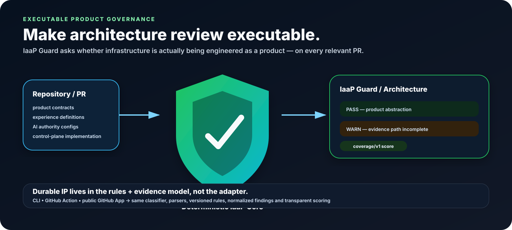
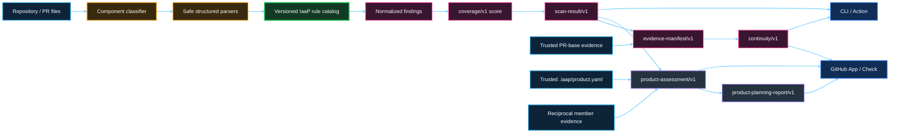
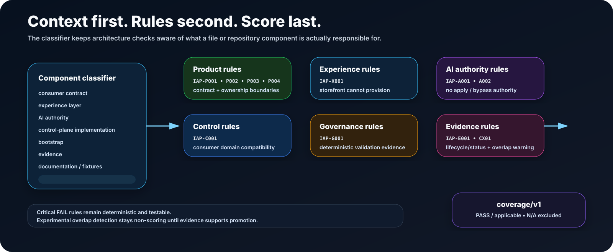

<p align="center">
  
</p>

# IaaP Guard

> **IaaS is what you buy. Infrastructure-as-a-Product is what you build. IaaP Guard makes sure you keep building it that way.**

IaaP Guard is a GitHub-native architecture, product-governance, multi-repository product, and evidence-continuity system. It evaluates whether infrastructure is actually being engineered as a product, whether independently owned repositories still form one coherent product, and whether the evidence supporting a previously observed governance state still applies after change.

Its three product questions are:

> **Is this infrastructure actually being designed, delivered, and governed as a product?**
>
> **If the product spans repositories, do the registered members still agree at the product boundary?**
>
> **When the product changes, can we reconstruct what Guard observed, what changed, and whether accountable revalidation is required?**

IaaP Guard does **not** decide whether an action is legally, institutionally, operationally, security, compliance, exception, risk-acceptance, or deployment-authorized. Evidence continuity is not authorization continuity.

## Live-proven capabilities

Two previously experimental capabilities are now live-accepted.

### Multi-repository product scope — COMPLETE

Phase 12 proved trusted federation against a real two-repository product using reciprocal default-branch `.iaap/product.yaml` registration.

The live acceptance campaign demonstrated that:

- both member repositories could independently score **100**;
- trusted federation could still detect a real cross-repository `IAP-C001` contract incompatibility and fail the logical product at **96**;
- Guard generated a product-level Improvement Plan from that relationship finding;
- the targeted storefront correction moved the federated product to **SUCCESS 100**; and
- the primary member independently revalidated the remediated product at **SUCCESS 100** with complete 2/2 evidence.

Canonical evidence: [`artifacts/phase-12/live-federation-acceptance.json`](https://github.com/SAABOLImpactVenture/ai-powered-infrastructure-as-a-product/blob/main/artifacts/phase-12/live-federation-acceptance.json).

### PR-base Evidence Continuity — COMPLETE

Phase 14 proved the deployed GitHub App against a fresh pull request from current main.

The same PR demonstrated:

- **SUPPORTED** for a non-Guard-material change;
- **REVIEW REQUIRED** after a controlled Guard-material change;
- immutable GitHub PR-base/head evidence;
- preserved repository Check conclusion semantics; and
- advisory human-review disposition without expanding Guard authority.

Canonical evidence: [`artifacts/phase-14/live-acceptance.json`](https://github.com/SAABOLImpactVenture/ai-powered-infrastructure-as-a-product/blob/main/artifacts/phase-14/live-acceptance.json).

## Start here before installing

Run deterministic adoption preflight before the first meaningful evaluation:

```bash
PYTHONPATH=src python3 -m iaap_guard.cli preflight . --repository owner/name
```

A single repository can be `READY` without `.iaap/product.yaml`. Registered products add
GitHub-aware same-owner, visibility, App-access, reciprocity, immutable-revision, and
required-member diagnostics in the existing advisory Check output. See
[`docs/ADOPTION-READINESS.md`](docs/ADOPTION-READINESS.md).

For adoption prerequisites, multi-repository requirements, beta limits, and common failure modes, read **[`docs/ADOPTION-PREREQUISITES.md`](docs/ADOPTION-PREREQUISITES.md)**.

That guide answers practical questions such as:

- Why did the Check not appear?
- Why did Guard say `No relevant changes`?
- Why is Evidence Continuity `NOT ESTABLISHED` or `REVIEW REQUIRED`?
- Why is the Product Assessment missing?
- Why did a required repository become `INCOMPLETE`?
- How do multiple repositories enroll safely?
- What happens when member visibility differs?
- What are the repository-size and 12-member V1 limits?

## Product architecture

The product remains intentionally bounded: a deterministic, stateless repository/PR evaluator with a reusable local core and a least-privilege GitHub App adapter.

```text
Repository / PR files
        ↓
Component classifier
        ↓
Structured deterministic parsers
        ↓
Versioned IaaP rule catalog
        ↓
Normalized findings + coverage score
        ↓
scan-result/v1
        ├─────────────────────────────┐
        ↓                             ↓
Evidence Continuity             Product scope (optional)
base/head comparison            reciprocal member federation
        ↓                             ↓
evidence-manifest/v1           product-assessment/v1
        ↓                             ↓
continuity/v1                  product-planning-report/v1
        └──────────────┬──────────────┘
                       ↓
             GitHub Check / CLI output
```

### Architecture at a glance



Adapters remain thin around the same core:

```text
IaaP Guard Core
   ├── CLI
   ├── GitHub Action
   └── GitHub App
```

The adapter is not the product. The durable product IP is the system of IaaP product knowledge, deterministic rules, evidence, continuity semantics, cross-repository compatibility, planning traceability, and operating model.

<p align="center">
  
</p>

## Deterministic architecture evaluation

The deterministic core implements:

- context classification before rule evaluation;
- safe YAML/JSON and bounded text loading without executing repository code;
- all rules in `rules/catalog.yaml`;
- normalized `scan-result/v1` output;
- transparent `coverage/v1` scoring;
- human-readable and JSON CLI output;
- frozen positive/negative fixture contracts; and
- repeatability, schema, scoring, fixture-isolation, and non-execution tests.

Run the complete validation gate:

```bash
python3 -m pip install -r requirements-ci.txt
make validate
```

Run a local scan:

```bash
PYTHONPATH=src python3 -m iaap_guard.cli scan . \
  --repository example/platform-repo \
  --revision 0123456789abcdef0123456789abcdef01234567
```

Use `--format json` for the normalized machine-readable contract.

## Evidence Continuity

Architecture PASS/WARNING/FAIL is a point-in-time statement about the evidence Guard evaluated. Evidence Continuity compares a trustworthy prior Guard state with the current state and answers a narrower temporal question: **does the evidence supporting the previous Guard-observed state still apply?**

The core produces `evidence-manifest/v1` with `continuity/v1` semantics:

- **SUPPORTED** — no Guard-material rule/finding change was detected;
- **REVIEW REQUIRED** — Guard detected a material change that should be revalidated by an accountable human or governed process;
- **NOT ESTABLISHED** — a trustworthy comparison baseline was not available.

The evidence record can preserve exact revisions, ruleset/scoring versions, rule-state transitions, introduced/resolved finding evidence, Guard materiality, bounded disposition, and deterministic SHA-256 evidence digests.

Generate evidence locally:

```bash
PYTHONPATH=src python3 -m iaap_guard.cli evidence . \
  --repository example/platform-repo \
  --revision <CURRENT_SHA> \
  --baseline prior-scan-result.json \
  --scan-output current-scan-result.json \
  --format json
```

See [`docs/EVIDENCE-CONTINUITY.md`](docs/EVIDENCE-CONTINUITY.md).

## PR-base Evidence Continuity

For an IaaP-relevant pull request, the GitHub App uses the immutable **PR-base SHA** as the technical evidence baseline and the immutable **PR-head SHA** as the current state.

```text
GitHub PR
   ├── base SHA ──→ deterministic scan ──┐
   └── head SHA ──→ deterministic scan ──┤
                                         ↓
                              evidence-manifest/v1
                                         ↓
                                   continuity/v1
                                         ↓
                     IaaP Guard / Architecture Check
```

The PR cannot nominate its own baseline. Evidence Continuity remains advisory: repository scan semantics still own the GitHub Check conclusion, while `REVIEW REQUIRED` signals that prior evidence should not silently be treated as still applicable.

See [`docs/PR-BASE-EVIDENCE-CONTINUITY.md`](docs/PR-BASE-EVIDENCE-CONTINUITY.md).

## From architecture evidence to an improvement plan

IaaP Guard can translate deterministic findings into a versioned, traceable Improvement Plan:

```text
Architecture Evidence → Objectives → Key Results → Epics → Features → Candidate User Stories → Candidate Tasks → Acceptance Evidence
```

Epics map to measurable Key Results, and proposed work retains traceability back to the Guard rule and repository/product evidence that caused it.

The planning layer remains advisory. Guard does not assign work, manage sprints, estimate capacity, autonomously create backlog items, or execute remediation.

See [`docs/PLANNING-REPORT.md`](docs/PLANNING-REPORT.md).

## One product, multiple repositories

A product contract, storefront, control plane, governance policy, evidence, and integration tests can remain independently owned while still forming **one logical infrastructure product**.

Register that boundary with trusted reciprocal `.iaap/product.yaml` manifests:

```text
platform-contracts ─┐
backstage-storefront ├──→ IaaP Product Assessment
crossplane-control  ┤        ↓
platform-policies   ┤   Product Improvement Plan
platform-evidence  ─┘
```

Product scope adds:

- `iaap-product/v1` membership and role metadata;
- `product-assessment/v1` across registered member repositories;
- aggregate dimension coverage plus the weakest-member score;
- **INCOMPLETE** when required repository evidence is unavailable;
- fail-safe semantics so a member FAIL cannot be averaged away;
- cross-repository consumer/canonical contract compatibility checks;
- repository-qualified finding traceability; and
- `product-planning-report/v1`.

The GitHub App does not trust a PR—or one repository acting alone—to expand related-repository read scope. Product membership is read from trusted **default branches**, and a related repository participates only when it reciprocally declares the same product identity and membership, is under the same owner, has the same visibility, and is accessible through IaaP Guard.

V1 supports at most **12 registered repositories** per product. See [`docs/MULTI-REPOSITORY-PRODUCTS.md`](docs/MULTI-REPOSITORY-PRODUCTS.md) and the adoption prerequisite guide before enabling federation.

## Public GitHub App beta

The App remains a small stateless adapter around the deterministic core.

```text
GitHub PR event
    ↓
Public GitHub App webhook
    ↓
X-Hub-Signature-256 verification
    ↓
Short-lived repository-scoped installation token
    ↓
Immutable PR head + trusted PR base snapshots
    ↓
Deterministic repository scan + continuity
    ↓
Optional trusted multi-repository federation
    ↓
IaaP Guard / Architecture Check
```

The App authority is frozen in `config/github-app-v0.json`:

- Metadata: read;
- Contents: read;
- Pull requests: read;
- Checks: write;
- no PAT;
- no repository content writes;
- no workflow/administration permissions;
- no cloud, Kubernetes, Terraform/TFE, or AI credentials.

The canonical V1 exclusions are maintained in
[`docs/PRODUCT.md#explicit-exclusions`](docs/PRODUCT.md#explicit-exclusions). In
particular, Guard does not ingest organizational OKRs, manage enterprise strategy or
team work, execute infrastructure, or acquire customer infrastructure credentials.

The initial hosting implementation uses AWS Lambda + Function URL. Hosting remains replaceable and is not part of the rule engine or consumer contract.

See [`docs/GITHUB-APP-BETA.md`](docs/GITHUB-APP-BETA.md).

## Product principles

- Product over tooling.
- Stable consumer contracts.
- Replaceable experience layer.
- Bounded intelligence.
- Deterministic governance.
- Human authorization.
- Evidence first.
- Evidence continuity is not authorization continuity.
- Reciprocal trust before cross-repository federation.
- One authoritative reconciler.
- Least privilege.
- Context-aware analysis rather than naive keyword grep.
- Fail closed when required evidence is unavailable.
- Minimum effort first.

## Repository contents

- `docs/ADOPTION-PREREQUISITES.md` — install/adoption requirements, multi-repo prerequisites, beta limits, and troubleshooting.
- `docs/ADOPTION-READINESS.md` — executable preflight, readiness-report/v1, requirement IDs, and authority boundaries.
- `docs/PRODUCT.md` — product definition, proven outcomes, and explicit exclusions.
- `docs/ARCHITECTURE.md` — deterministic center, evidence continuity, federation, and adapter boundaries.
- `docs/CORE.md` — implemented deterministic engine plus evidence contract and limitations.
- `docs/EVIDENCE-CONTINUITY.md` — evidence-manifest and continuity semantics.
- `docs/PR-BASE-EVIDENCE-CONTINUITY.md` — PR base/head continuity adapter contract and live proof.
- `docs/MULTI-REPOSITORY-PRODUCTS.md` — product membership, cross-repository trust, live proof, assessment, and planning semantics.
- `docs/PLANNING-REPORT.md` — OKR-to-backlog planning semantics and product boundary.
- `docs/RULE-CATALOG.md` — deterministic rule semantics.
- `docs/SCORING.md` — transparent coverage-based maturity model.
- `docs/DOGFOOD.md` — six-repository evidence plan.
- `docs/GITHUB-ACTION.md` — Action adapter and authority boundary.
- `docs/GITHUB-APP-BETA.md` — public GitHub App contract, deployment guide, continuity, federation, and beta limits.
- `schemas/scan-result.schema.json` — normalized repository result contract.
- `schemas/evidence-manifest.schema.json` — normalized evidence and continuity contract.
- `schemas/planning-report.schema.json` — normalized repository improvement-plan contract.
- `schemas/product-manifest.schema.json` — multi-repository product membership contract.
- `schemas/product-assessment.schema.json` — normalized product assessment contract.
- `schemas/product-planning-report.schema.json` — normalized product improvement-plan contract.
- `schemas/readiness-report.schema.json` — normalized repository/product adoption-readiness contract.
- `src/iaap_guard/` — deterministic core plus thin GitHub App, evidence, planning, and product-scope adapters.
- `tests/` — frozen fixture, engine-invariant, adapter/security, evidence-continuity, planning, and product-scope tests.

## Current status

- **PHASE 8 — Deterministic Core: COMPLETE**
- **PHASE 9 — Dogfood POC: COMPLETE**
- **PHASE 10 — Public Installable Beta: COMPLETE**
- **PHASE 11 — Evidence-to-Planning Layer: COMPLETE**
- **PHASE 12 — Multi-Repository Product Scope: COMPLETE**
- **PHASE 13 — Evidence Continuity Core: COMPLETE**
- **PHASE 14 — PR-base Evidence Continuity: COMPLETE**
- **PHASE 15 — Adoption Readiness / Preflight: COMPLETE**
- **PHASE 16 — Public Beta Closure: COMPLETE**
- **PHASE 17 — External Adoption Validation: PLANNED**
- **PHASE 18 — V1 Product Completion: PLANNED**

Phase 12 is closed by real reciprocal two-repository federation, a live cross-repository incompatibility finding, evidence-backed product planning, targeted remediation, and SUCCESS 100 revalidation. Phase 14 is closed by deployed-App evidence showing `SUPPORTED` followed by `REVIEW REQUIRED` on the same fresh pull request after a controlled Guard-material change. Phase 15 is closed by deployed READY → BLOCKED → READY acceptance with retained evidence. Phase 16 is closed by retained operational, security, clean-adopter, boundary-consistency, and protected-validation evidence. Phases 17–18 validate independent adoption and publish the bounded V1 product without expanding Guard into work management, infrastructure execution, enterprise strategy, or automated remediation.
