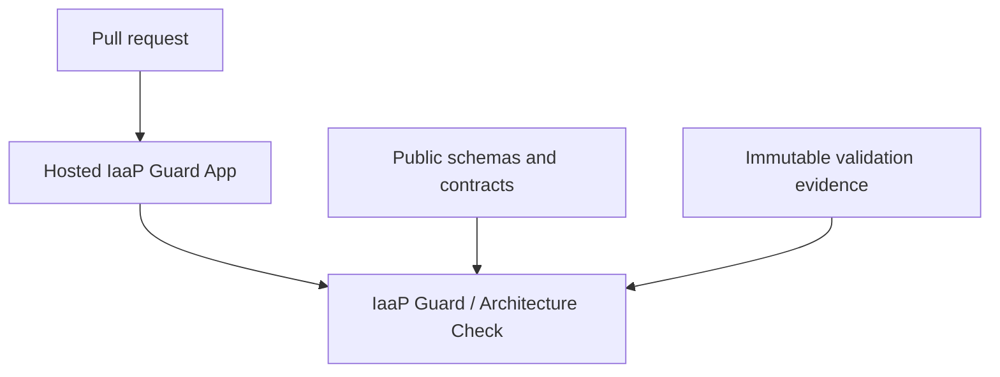

# IaaP Guard architecture

## Public product boundary

IaaP Guard is delivered as a hosted GitHub App. This repository publishes the product contracts, schemas, adoption guidance, evidence, and authority boundaries needed to understand and evaluate the service without publishing the hosted implementation.

The hosted service verifies signed GitHub webhook deliveries, uses short-lived repository-scoped installation tokens, reads immutable repository revisions, evaluates deterministic product rules, and publishes a GitHub Check. The implementation, rule execution, deployment assets, and internal regression suite are maintained privately.

## Public interfaces

- `schemas/` defines the published evidence and product document shapes.
- `config/github-app-v0.json` records the public GitHub App permission and event contract.
- `docs/` explains adoption, product behavior, limits, support, and authority boundaries.
- `artifacts/` retains public validation evidence.

## Permissions

The GitHub App is bounded to metadata read, contents read, pull-request read, and checks read/write. It does not request repository content-write, workflow administration, merge, customer-cloud, provisioning, or remediation authority.

## Distribution

The former composite Action is retired. The hosted GitHub App is the supported distribution path. Historical revisions remain accessible through Git history, which was not rewritten.
